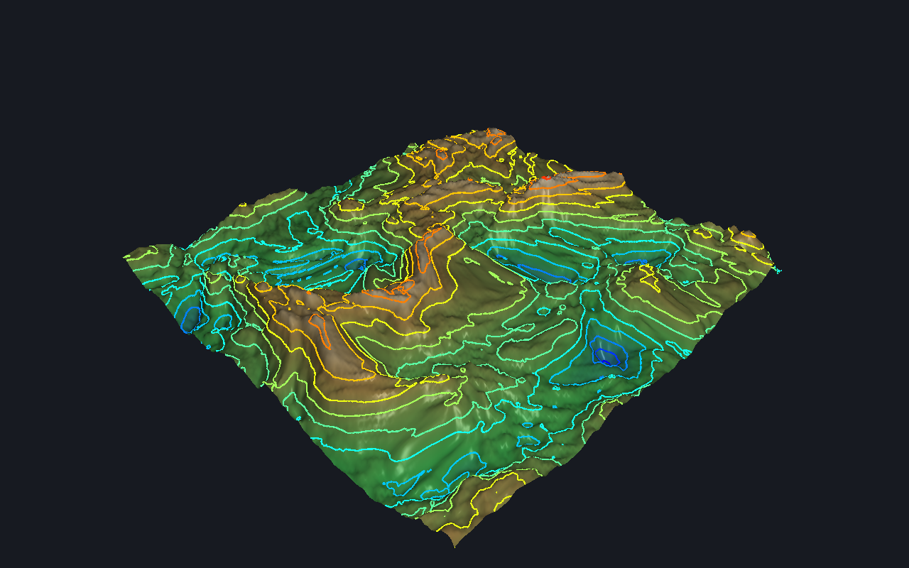
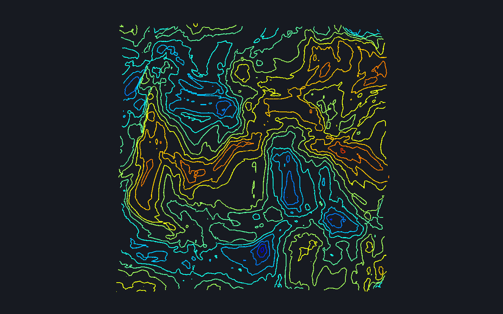

# Tarea 3 — Curvas de nivel de un terreno (CC7515)

Visualizador de un terreno como **curvas de nivel**, en **C++ + GLFW + GLAD**, con
pipeline de **vertex + fragment + geometry shader**. Cumple la Opción 2 del enunciado.

## Qué hace

- Genera un **terreno fractal** de `160×160 = 25.600` puntos (≥ 10.000 pedidos). La
  **altura la calcula el vertex shader** a partir de ruido fractal (fBm); al
  presionar **G** cambia la semilla y nace una **superficie nueva**.
- Dibuja la superficie con **iluminación** (luz **puntual** + **ambiental**) y un
  colormap topográfico, para un aspecto realista.
- Extrae las **curvas de nivel** con un **geometry shader**: por cada triángulo que
  intersecta la altura `H`, emite un **segmento** (marching triangles en GPU),
  engrosado a un **quad de ancho fijo en píxeles** (grosor robusto en cualquier
  driver, no depende de `glLineWidth`). Cada **nivel se pinta de un color distinto**.
- **Modo "curva única"** (tecla **U**): dibuja una sola curva a una **altura definida
  por el usuario** en metros, ajustable con `[` `]`.
- **Cámara orbital** con **zoom**; el usuario ajusta las alturas de las curvas, la
  cantidad de niveles y la iluminación (luz **movible**). Vista cenital (**T**) para
  ver el mapa de curvas como en la Figura 1 del enunciado.
- Extras de calidad/innovación: **domain warping** del ruido (relieve orgánico, sin
  artefactos de grilla), **animación de oleaje** (tecla **M**), **MSAA 4×** y captura
  de imagen (tecla **P**).

## Capturas

| Perspectiva (superficie + curvas) | Cenital, solo curvas (≈ Figura 1) |
|---|---|
|  |  |

## Requisitos

- CMake ≥ 3.16, un compilador C++17 (g++/clang).
- **GLFW 3** (`libglfw3-dev`). GLAD ya viene incluido en `third_party/glad/`
  (OpenGL 3.3 core, con soporte de geometry shader). No se necesita GLM.
- GPU/driver con **OpenGL ≥ 3.3** (el geometry shader es core desde 3.2).

En Debian/Ubuntu/Pop!\_OS:
```bash
sudo apt install -y libglfw3-dev cmake g++
```

## Compilar y ejecutar

```bash
cd curvas_de_nivel
cmake -S . -B build
cmake --build build -j
./build/curvas
```
La ruta a los shaders queda compilada en el binario (`SHADER_DIR`), así que se puede
ejecutar desde cualquier directorio.

### Modo captura (verificación / sin pantalla)

```bash
./build/curvas --shot salida.ppm [frames] [--topdown] [--no-surface] [--waves] [--single METROS]
```
Renderiza con la ventana oculta, guarda un PPM y sale. Útil para validar el render
en una máquina sin sesión gráfica (p.ej. vía `xvfb-run` para usar Mesa por software).

## Controles

| Entrada            | Acción                                                        |
|--------------------|---------------------------------------------------------------|
| Arrastrar mouse    | Orbitar la cámara (todas las perspectivas)                    |
| Rueda / `+` `-`    | Zoom / un-zoom                                                |
| **G**              | Generar una superficie nueva (vertex shader)                  |
| **U**              | Modo "curva única" a una altura definida (on/off)             |
| `[` `]`            | Bajar / subir la altura (de las curvas, o de la curva única)  |
| `,` `.`            | Menos / más niveles de curva                                  |
| **M**              | Animación de oleaje del terreno on/off                        |
| `K` `J`            | Menos / más luz ambiental                                     |
| `L`                | Animar la luz puntual on/off                                  |
| Flechas            | Mover la luz (azimut ←/→, altura ↑/↓)                         |
| `Espacio`          | Mostrar/ocultar la superficie (ver solo las curvas)          |
| `T`                | Vista cenital (mapa de curvas, como la Figura 1)              |
| `W`                | Malla en alambre on/off                                       |
| `P`                | Guardar captura (`captura.ppm`)                               |
| `R`                | Resetear la cámara                                            |
| `ESC`              | Salir                                                         |

## Features cumplidas

| Feature | Dónde |
|---|---|
| Terreno por puntos y triángulos, Z = altura (0–6000 m) | `terrain.h` (grilla triangulada) + `common.glsl` (`terrainHeight`, escalada a metros en la UI) |
| ≥ 10.000 puntos, función fractal | `GRID_N=160` (25.600 pts) + fBm en `common.glsl` |
| Zoom / un-zoom | `camera.h` `zoom()` (rueda y teclas) |
| Cámara desde todas las perspectivas | `camera.h` órbita yaw/pitch |
| Luz puntual + ambiental (movible) | `terrain.frag` (Phong) + flechas mueven `uLightPos` |
| **Vertex shader** que cambia la posición y genera nueva superficie con una tecla | `terrain.vert` / `contour.vert` + tecla **G** (uniform `uSeed`) |
| **Fragment shader** que pinta cada curva distinta por nivel | `contour.frag` (uniform `uColor` por nivel) |
| Usuario **define la altura** en que se dibuja la curva; **geometry shader** emite un segmento por triángulo que la intersecta | modo curva única (**U** + `[` `]`, en metros) y set de niveles, ambos en `contour.geom` |
| Interfaz interactiva | callbacks de teclado/mouse en `main.cpp` + HUD en metros en el título |

## Estructura

```
curvas_de_nivel/
├── CMakeLists.txt
├── include/        mathx.h (álgebra), shader.h, camera.h, terrain.h  (header-only)
├── src/main.cpp    ventana, bucle de render, dos pases, interfaz
├── shaders/        common.glsl (fBm) + terrain.{vert,frag} + contour.{vert,geom,frag}
└── third_party/glad/   loader OpenGL 3.3 core (vendorizado)
```

## Notas de implementación

- El **VBO solo guarda (x,y)**; la altura se calcula en el shader, por eso cambiar
  la semilla no reconstruye buffers.
- `common.glsl` se **inyecta tras `#version`** en ambos vertex shaders (ver
  `shader.h`), garantizando que superficie y curvas usen la misma altura.
- La superficie usa **polygon offset** para que las curvas (que viven sobre ella) no
  hagan z-fighting y queden visibles encima. Se dibuja **siempre** (con `glColorMask`
  apagado cuando se "oculta"): así el depth buffer **ocluye las curvas del lado
  oculto** del terreno y el mapa se ve limpio.
- Las curvas se **engrosan en el geometry shader** (cada segmento → un quad expandido
  en espacio de pantalla), evitando la dependencia de `glLineWidth` (no portable en
  core profile). Combinado con **MSAA 4×** da líneas nítidas en cualquier GPU.
